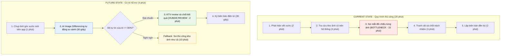
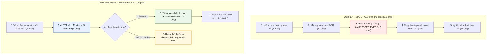

# 01 — Individual Problem Scan

> Điền theo Phase 1 + Phase 2 trong `01-worksheet.md`. Tự scan trước, dùng AI sau để phản biện. Không copy ví dụ Weekly Report.

## Thông tin cá nhân

- Họ và tên: Nguyễn Thị Chinh
- Mã học viên: 2A202602876
- Vai trò / bối cảnh (VD: sinh viên năm X, intern PM, ...): AI Engineer tại Vin Smart Future / Vingroup
- Công việc hằng tuần (3-5 gạch đầu dòng để soi problem):
  - Nghiên cứu mô hình Computer Vision và quy trình giám sát chất lượng phương tiện vận tải điện.
  - Phân tích dữ liệu vận hành đội xe (Fleet Operations) của GSM (Xanh SM).
  - Đánh giá hiện trạng kiểm tra an toàn vận doanh (DVIR) và quy trình bàn giao xe giữa các ca.
  - Phối hợp với đội kỹ thuật Depot để xác định các điểm nghẽn (bottlenecks) trong khâu nghiệm thu và sạc pin.
  - Xây dựng giải pháp AI hỗ trợ tự động hóa phát hiện hư hỏng và tối ưu hóa vận hành fleet.

---

## Phase 1 — Scan 5+ problems (tối thiểu 5, khuyến khích 8-10)

**Cách điền:** mỗi dòng = việc gì + ai chịu + đo bằng gì. Cột `Dấu hiệu thật` bắt buộc có số: mất bao lâu (bấm giờ mấy lần), mấy lần/tuần, bao nhiêu người gặp, log/ticket/quote nào.

| # | Lăng kính (Lặp lại / Tốn thời gian / AI có thể tốt hơn / Pain từ người khác) | Problem quan sát được | Ai chịu ảnh hưởng? | Dấu hiệu thật (số + bằng chứng) |
|---|---|---|---|---|
| 1 | Tốn thời gian | Khi kiểm tra an toàn vận doanh hàng ngày, tài xế điền form báo cáo tình trạng xe trên app | Tài xế | Theo GAO, FMCSA ước tính một DVIR (Driver Vehicle Inspection Report) mất: 2 phút 30 giây để điền báo cáo, thêm 20 giây để review + ký nếu có lỗi hoặc 5 giây nếu không có lỗi. [Paper](https://www.gao.gov/assets/gao-15-340r.pdf) |
| 2 | AI có thể tốt hơn | Tài xế chụp ảnh 4 hướng thân xe để xác thực tình trạng xe, đôi khi không đủ dữ kiện để nhân viên kiểm tra xe đánh giá | Nhân viên kiểm tra xe, tài xế | Một nghiên cứu về kiểm tra xe tự động đạt độ chính xác 68,7% khi xác định vị trí hư hỏng và 54,2% khi xác định mức độ hư hỏng. Điều này cho thấy ảnh không phù hợp về góc chụp có thể không cung cấp đủ thông tin để đánh giá chính xác damage. [Paper](https://link.springer.com/article/10.1007/s12652-022-04105-3)|
| 3 | Tốn thời gian | Nhân viên dò lịch sử ảnh để phân định vết xước cũ hay mới, có phải do va chạm hay không | Nhân viên kiểm tra xe | Trong một thử nghiệm kéo dài 5 tháng, AFS Group phải đối chiếu thủ công 12.000 ảnh kiểm tra xe để xác định hư hỏng mới. Sau khi áp dụng AI, doanh nghiệp ước tính thời gian tiết kiệm tương đương 1 nhân viên toàn thời gian. [Article](https://afsgroup.uk/case_studies/afs-improving-how-we-identify-fleet-damage-using-ai-technology/?utm_source=chatgpt.com)|
| 4 | Pain từ người khác | Tài xế ca trước trả xe lúc cạn pin dẫn đến ca sau không có xe đi, ảnh hưởng doanh thu, khách hàng | Tài xế ca sau, khách hàng| Pin LFP dung lượng 60,13 kWh cho quãng đường di chuyển khoảng 450 km/lần sạc, thời gian sạc từ 10% đến 70% trong khoảng 30 phút. [Link](https://www.greensm.com/vn-vi/news/xanh-sm-ra-mat-dich-vu-taxi-dien-7-cho-cao-cap-xanh-sm-limo)|
| 5 | Lặp lại | Nghiệm thu vệ sinh khoang nội thất của xe | Tài xế ca sau, khách hàng | Trong dữ liệu ACSI 2026, độ sạch của xe tiếp tục được theo dõi như một chỉ số riêng về trải nghiệm của khách hàng của dịch vụ gọi xe, đạt 81/100. [Paper](https://www.sciencedirect.com/science/article/abs/pii/S2213624X22001584)|

> Gợi ý tự soi: tuần trước mất nhiều thời gian nhất vào việc gì? Việc gì hay trì hoãn? Người khác hay hỏi lại câu gì? Workflow nào ai cũng biết là chậm?

**AI đã dùng ở Phase 1 (nếu có):**
- Prompt đã hỏi: *"Tôi là AI Engineer tại Vin Smart Future (Vingroup). Tôi đang tìm kiếm các pain point vận hành cụ thể có thể tối ưu bằng AI cho mảng Xanh SM. Hãy gợi ý cho tôi 5 quy trình nghiệp vụ thủ công, tốn nhiều thời gian và gây rò rỉ hiệu suất kèm con số thống kê ước tính về tổn thất."*
- Ý dùng được: So khớp ảnh vết xước cũ/mới, quy trình điền form an toàn đầu ca (DVIR), tối ưu lịch điều phối sạc pin trước khi giao ca.
- Ý bỏ vì không phải pain thật: Nhận diện mùi/vệ sinh nội thất bằng camera (thiếu khả thi phần cứng cảm biến và tính định lượng thấp); tối ưu hóa toàn bộ mạng lưới fleet (phạm vi quá rộng, không cô lập được bottleneck).

**Self-check Phase 1:**
- [x] Đủ 5+ dòng, mỗi dòng có actor + số đo cụ thể
- [x] Dùng ít nhất 3/4 lăng kính
- [x] Không có dòng chung chung kiểu "mất nhiều thời gian"

---

## Phase 2 — Top 3 Problem Cards

### 2.1. Chọn top 3

Giữ bài nào: actor cụ thể, workflow vẽ được 3-7 bước, bottleneck ở 1 bước, impact đo được. Loại bài quá rộng.

| Rank | Problem (copy từ bảng scan) | Vì sao chọn (2-3 ý) | Điều còn chưa chắc |
|---|---|---|---|
| 1 | Nhân viên dò lịch sử ảnh để phân định vết xước cũ hay mới, có phải do va chạm hay không | Actor cụ thể (Nhân viên kiểm định), Workflow 4 bước, bottleneck ở bước tra cứu và soi ảnh đối chiếu thủ công bằng mắt thường, impact đo bằng thời gian kiểm tra | Khác biệt về ánh sáng, thời tiết |
| 2 | Khi kiểm tra an toàn vận doanh hàng ngày, tài xế điền form báo cáo tình trạng xe trên app | Actor tài xế, workflow 3 bước, bottleneck ở bước tài xế điền form thủ công, impact đo được bằng thời gian submit báo cáo | Khoảng thời gian rút gọn được có thật sự đáng kể không |
| 3 | Tài xế ca trước trả xe lúc cạn pin dẫn đến ca sau không có xe đi, ảnh hưởng doanh thu, khách hàng | Actor tài xế, workflow 4 bước, bottleneck ở bước xe phải nằm sạc khi ca sau bắt đầu hoạt động, impact đo bằng doanh thu bị ảnh hưởng | Cần quyền truy cập API dữ liệu pin thời gian thực (telemetry) của xe và cách kiểm soát việc tài xế ca trước cố tình chạy thêm cuốc cuối. |

### 2.2. Problem Cards chi tiết (lặp lại cho cả 3 cards)

---

#### Problem Card #1 — Nhân viên dò lịch sử ảnh để phân định vết xước cũ hay mới

```text
Problem 1 câu: Nhân viên dò lịch sử ảnh để so sánh giữa 2 ảnh, từ đó phân định vết xước cũ hay mới, có phải do va chạm hay không.

Actor: Nhân viên kiểm định tại Depot (Inspector) & Tài xế giao ca.

Thời điểm / bối cảnh: Thời điểm bàn giao xe giữa hai ca hoặc khi tài xế trả xe về Depot Xanh SM và phát hiện vết xước nghi vấn.

Current workflow 3-7 bước:
1. Nhân viên phát hiện vết xước trên thân vỏ xe trong lúc kiểm tra ngoại quan.
2. Nhân viên mở web/app nội bộ, tra cứu kho ảnh lịch sử các ca trước theo biển số xe.
3. Nhân viên soi từng bức ảnh bằng mắt thường, phóng to để đối chiếu góc chụp và vị trí vết xước.
4. Nhân viên xác định vết xước cũ hay mới, có phải do va chạm hay không.
5. Nhân viên ghi nhận vào hệ thống và lập biên bản đền bù nếu phát sinh lỗi mới.

Bottleneck: Bước 3 — Đối chiếu thủ công bằng mắt thường giữa ảnh lưu trữ và xe thực tế (mất 15–20 phút/xe có tranh chấp, dễ sót lỗi do góc chụp và độ sáng khác nhau).

Impact: Mất 15–20 phút/xe có tranh chấp; gây ùn ứ bàn giao xe tại depot; chi phí khắc phục sơn vỏ xe 800.000–1.500.000 VNĐ/vết; tạo tâm lý ức chế, khiếu nại đền bù giữa tài xế và công ty.

Success metric: Giảm thời gian đối chiếu vết xước từ 15–20 phút xuống dưới 2 phút/xe; cải thiện độ chính xác phát hiện sai khác (Image Differencing) đạt ≥ 90%; giảm 85% số vụ tranh cãi bồi thường.

Non-AI alternative: Vẽ sơ đồ 2D vị trí vết xước trên giấy/app (nhược điểm: tài xế đánh dấu ẩu, không phân biệt được độ nông/sâu hoặc vết mới trên cụm vết xước cũ).

AI hypothesis: Dùng Computer Vision (Image Registration căn góc + Siamese Network / Image Differencing) so khớp tự động ảnh hiện tại với ảnh ca trước, tự động khoanh vùng bounding box và highlight vết xước mới xuất hiện.

Quick gut:
[ ] No AI / process fix
[ ] Rule
[x] Workflow
[ ] Agent
[ ] Chưa biết
```

**Draft workflow Card #1** (ASCII / Mermaid / ảnh đính kèm):



> **Fallback:** Nếu ảnh mờ/lóa hoặc độ tự tin của AI < 80%, hệ thống tự động gắn cờ "Manual Review" và chuyển sang quy trình KTV tra cứu kho ảnh thủ công như cũ.

File đính kèm (nếu vẽ riêng): `01-individual-problem-scan-workflow-card-1.png`

---

#### Problem Card #2 — Điền form báo cáo an toàn vận doanh hàng ngày (DVIR)

```text
Problem 1 câu: Khi kiểm tra an toàn vận doanh hàng ngày, tài xế phải dừng xe gõ chữ và tick chọn thủ công 15–20 mục trên form DVIR, gây mất thời gian và dẫn đến tình trạng điền vẹt, bỏ qua kiểm tra an toàn thực tế.

Actor: Tài xế Xanh SM & Bộ phận Quản lý An toàn Vận doanh (Fleet Safety Ops).

Thời điểm / bối cảnh: 10–15 phút trước khi bắt đầu ca vận doanh hàng ngày tại bãi xe hoặc điểm nhận bàn giao xe.

Current workflow 3-7 bước:
1. Tài xế đi vòng quanh xe kiểm tra các hạng mục an toàn (đèn, còi, lốp, phanh, gương, kính).
2. Mở app tài xế, truy cập form kiểm tra an toàn vận doanh đầu ca (DVIR).
3. Dùng tay tick chọn từng mục checklist (15–20 tiêu chí) và gõ bàn phím mô tả lỗi nếu có bất thường.
4. Chụp ảnh xác thực đồng hồ taplo và ngoại quan xe.
5. Ký tên điện tử và submit báo cáo lên hệ thống.

Bottleneck: Bước 3 — Tài xế phải dừng lại bấm từng ô checklist và gõ phím mô tả lỗi trên màn hình điện thoại nhỏ (mất 2.5–4 phút/lượt, dễ điền đối phó cho nhanh).

Impact: Tốn ~3 phút/xe × 30.000 tài xế ≈ 1.500 giờ lao động mỗi ngày; nguy cơ bỏ sót hư hỏng kỹ thuật tiềm ẩn gây sự cố giữa đường (chi phí cứu hộ và sửa chữa 500.000–2.000.000 VNĐ/vụ).

Success metric: Rút ngắn thời gian hoàn thành form từ ~3 phút xuống dưới 45 giây; tăng tỷ lệ phát hiện và ghi nhận lỗi thực tế từ 30% lên > 90%; 100% tài xế hoàn thành đúng hạn đầu ca.

Non-AI alternative: Tạo nút tắt "Tất cả bình thường" 1-click trên giao diện app (nhược điểm: tài xế càng ỉ lại bấm 1 nút cho xong mà không hề đi kiểm tra xe thực tế).

AI hypothesis: Tính năng Voice-to-Form bằng Speech-to-Text kết hợp LLM Entity Extraction: Tài xế đeo tai nghe vừa kiểm tra vừa nói khẩu lệnh, AI tự trích xuất thực thể, tick đúng ô và điền sẵn text mô tả.

Quick gut:
[ ] No AI / process fix
[ ] Rule
[x] Workflow
[ ] Agent
[ ] Chưa biết
```

**Draft workflow Card #2:**



> **Fallback:** Nếu môi trường quá ồn hoặc AI không nhận diện được giọng nói, app tự động mở lại giao diện form checklist bấm tay truyền thống.

File đính kèm: `01-individual-problem-scan-workflow-card-2.png`

---

#### Problem Card #3 — Tài xế ca trước trả xe lúc cạn pin dẫn đến ca sau không có xe đi

```text
Problem 1 câu: Tài xế ca trước trả xe khi mức pin cạn (< 20%) khiến tài xế ca sau phải nằm chờ sạc 45–60 phút ngay đầu ca cao điểm, gây lãng phí giờ đón khách và thất thoát doanh thu.

Actor: Tài xế nhận xe ca sau (chịu thiệt), Tài xế ca trước & Điều phối viên bãi giao ca (Depot Dispatcher).

Thời điểm / bối cảnh: Thời điểm giao nhận ca vận doanh (6h00–7h00 sáng hoặc 14h00–15h00 chiều) tại các bãi xe/depot Xanh SM.

Current workflow 3-7 bước:
1. Tài xế ca trước lái xe về bãi giao ca với mức pin cạn (< 20%).
2. Hai tài xế gặp mặt, kiểm tra tình trạng xe và ký biên bản giao nhận.
3. Tài xế ca sau nhận xe, không thể nhận khách ngay mà phải lái đi tìm trụ sạc còn trống.
4. Cắm sạc và ngồi chờ 45–60 phút để pin đạt mức tối thiểu (≥ 70%).
5. Rút sạc, bật app bắt đầu nhận cuốc đón khách.

Bottleneck: Bước 3 & 4 — Xe phải nằm sạc chết 45–60 phút ngay đầu ca, rơi đúng vào khung giờ vàng cao điểm đón khách sáng/chiều.

Impact: Tài xế ca sau mất 80.000–120.000 VNĐ doanh thu/ca; tỷ lệ xe cạn pin chiếm 12–16% tổng số lượt giao ca; giảm tỷ lệ đáp ứng cuốc (fulfillment rate) của toàn hệ thống 3–5% trong giờ cao điểm.

Success metric: Giảm tỷ lệ xe cạn pin khi bàn giao từ 15% xuống dưới 2%; giảm thời gian chờ sạc đầu ca của tài xế ca sau từ 45 phút xuống dưới 5 phút; cứu lại 100% giờ vàng đón khách.

Non-AI alternative: Áp dụng chế tài phạt tiền nếu tài xế trả xe pin < 50% (nhược điểm: tài xế phản ứng tiêu cực hoặc từ chối chở các cuốc khách đi xa vào cuối ca, gây giảm sút chất lượng dịch vụ).

AI hypothesis: Điều phối thông minh (Smart Dispatching Agent): Trước giờ hết ca 45 phút, AI phân tích mức pin và vị trí trạm sạc, chỉ gán các "cuốc tiện đường về bãi sạc" (Destination Dispatch); đồng thời tự động kích hoạt hoán đổi xe đã sạc sẵn tại bãi (Vehicle Swapping) nếu xe về muộn.

Quick gut:
[ ] No AI / process fix
[ ] Rule
[ ] Workflow
[x] Agent
[ ] Chưa biết
```

**Draft workflow Card #3:**

```mermaid
flowchart TD
    subgraph Current_State ["CURRENT STATE - Quy trình thủ công (60 phút)"]
        C1["1. Ca trước trả xe cạn pin dưới 20% (2 phút)"] --> C2["2. Ký nhận bàn giao xe (3 phút)"]
        C2 --> C3["3. Lái xe đi tìm trụ sạc còn trống (10 phút)"]
        C3 --> C4["4. Ngồi chờ cắm sạc pin (BOTTLENECK - 45 phút)"]
        C4 --> C5["5. Bật app đón khách khi pin >= 70% (1 phút)"]
    end

    subgraph Future_State ["FUTURE STATE - Smart Dispatching Agent (5 phút)"]
        F1["1. Trước giao ca 45 phút: AI giám sát pin xe"] --> F2["2. AI Destination Dispatch: Gán cuốc tiện đường về trạm"]
        F2 --> F3{"Xe về bãi đạt pin >= 70%?"}
        F3 -- "Đủ pin" --> F4["3. Bàn giao và nhận xe ngay (HUMAN ACTION - 3 phút)"]
        F4 --> F5["4. Bật app đón khách ngay (2 phút)"]
        F3 -- "Pin dưới 30%" --> F6["Fallback: Hoán đổi xe đã sạc sẵn từ bãi rửa (3 phút)"]
        F6 --> F5
    end

    style C4 fill:#FFEAEA,stroke:#D32F2F,color:#111
    style F2 fill:#E8F1FF,stroke:#2F6FED,color:#111
    style F4 fill:#EAF7EA,stroke:#388E3C,color:#111
    style F5 fill:#EAF7EA,stroke:#388E3C,color:#111
    style F6 fill:#FFF8E1,stroke:#FFA000,color:#111
```



> **Fallback:** Nếu xe về bãi với pin < 30%, hệ thống tự động kích hoạt quy trình hoán đổi xe (Asset Rotation) cấp ngay một xe dự phòng đã sạc đầy/rửa sạch tại bãi, không để tài xế phải ngồi chờ sạc.

File đính kèm: `01-individual-problem-scan-workflow-card-3.png`

---

### 2.3. Card muốn pitch nhất (chuẩn bị 2 phút)

**Card tôi muốn pitch nhất:**

```text
Problem Card #3 — Tài xế ca trước trả xe lúc cạn pin dẫn đến ca sau không có xe đi, ảnh hưởng doanh thu, khách hàng
```

**Vì sao (2-3 câu: workflow gì, số đo gì, impact gì):**

```text
Quy trình giao nhận ca bị đứt gãy ở bước tiếp nhận năng lượng: xe cạn pin khiến tài xế ca sau mất 45–60 phút ngay đầu ca cao điểm chỉ để chờ sạc xe. Tỷ lệ xe bàn giao pin cạn ghi nhận thực tế từ 12–16%, gây thiệt hại trực tiếp 80.000–120.000 VNĐ doanh thu/ca cho tài xế và làm giảm 3–5% tỷ lệ đáp ứng cuốc (fulfillment) của toàn hệ thống Xanh SM. Đây là bài toán mang lại ROI kinh tế tức thì và bảo vệ trải nghiệm khách hàng mà các giải pháp tĩnh (như phạt tiền hành chính) đã thất bại vì gây xung đột với tài xế.
```

**Câu hỏi tôi muốn nhóm challenge (1-2 câu hỏi đúng chỗ yếu):**

```text
1. Nếu tài xế ca trước cố tình tắt app, chạy cuốc ngoài nền tảng hoặc cố nhận cuốc đi tỉnh xa vào cuối ca thì thuật toán điều phối có cưỡng chế và kéo xe về trạm sạc đúng giờ được không?
2. Việc duy trì cơ chế hoán đổi xe dự phòng (Asset Rotation) tại bãi có làm tăng chi phí đầu tư (CAPEX) xe nhàn rỗi không, hay có thể tận dụng xe vừa bảo dưỡng/rửa xong?
```

**AI phản biện Card (nếu có):**
- Điểm yếu AI chỉ ra: Mô hình phụ thuộc hoàn toàn vào quyền truy cập dữ liệu telemetry pin thời gian thực từ phần cứng xe VinFast; rủi ro xung đột lợi ích giữa mong muốn chạy ráng kiếm tiền của tài xế ca trước và quyền lợi nhận xe đủ pin của tài xế ca sau.
- Tôi sửa gì: Bổ sung cơ chế "Destination Dispatch Filter" (chỉ phát cuốc tiện đường về bãi sạc) kèm điểm thưởng ưu tiên nhận cuốc VIP cho ca làm việc tiếp theo để khuyến khích tài xế tự giác; sử dụng giải pháp Dynamic Swapping từ đội xe luân chuyển bảo dưỡng (0 đồng CAPEX xe mới).

### Self-check nộp phần 01
- [x] Có 5+ problems + top 3 Cards đủ field
- [x] Mỗi Card có workflow trước/sau + bottleneck + metric + fallback
- [x] Đã chọn 1 card pitch + câu hỏi challenge
